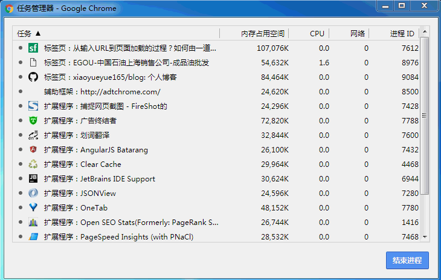
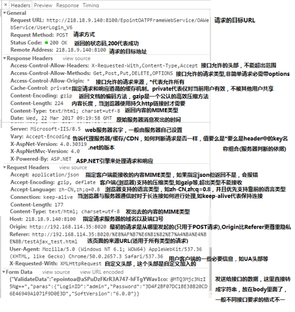
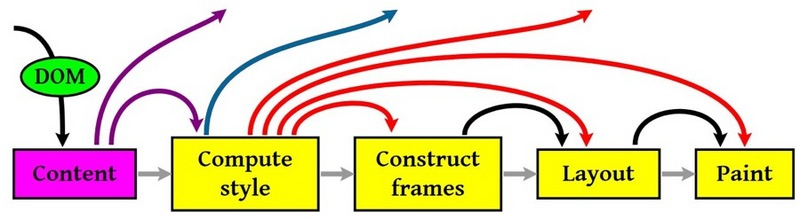

## 说明

一张网页，要经历怎样的过程，才能抵达用户面前？
一位新人，要经历怎样的成长，才能站在技术之巅？

##### 推荐

[从输入URL到页面加载的过程？如何由一道题完善自己的前端知识体系！](http://www.dailichun.com/2018/03/12/whenyouenteraurl.html)


## 梳理主干流程
1. [从浏览器接收url到开启网络线程](#从浏览器接收url到开启网络线程) 【浏览器的机制以及进程与线程之间的关系】
2. [开启网络线程到发出一个完整的http请求](#开启网络线程到发出一个完整的http请求) 【dns查询，tcp/ip协议，五层英特网协议】
3. [从服务器接收到请求到对应后台接收请求](#从服务器接收到请求到对应后台接收请求) 【负载均衡，安全拦截以及后台内部处理】
4. [后端与前台http交互](#后端与前台http交互)【http请求头，报文结构，响应码，编码解码】
5. 单独拎出来的缓存问题，http的缓存（这部分包括http缓存头部，etag，catch-control等）
6. [浏览器接收到http数据包后的解析过程](#浏览器接收到http数据包后的解析过程) 【解析html-词法分析然后生成dom树，解析css生成css规则树，合并成render树，然后layout，painting渲染，复合图层的合成，cpu绘制，外链资源的处理，DOMContentLoaded和load】
7. [css的可视化格式模型](#css的可视化格式模型)【元素的渲染规则，如包含块，控制框，BFC,IFC等概念】
8. [js引擎执行机制](#js引擎执行机制)【js解释阶段，预处理阶段，执行阶段生成执行上下文，vo，作用域链，回收机制等】
9. 其他（可以拓展的不同知识模块，如跨域，web安全，hybrid模式等等内容）

## 从浏览器接收url到开启网络线程

这一部分展开的内容是：浏览器进程/线程模型，JS的运行机制
### 区分进程与线程
````
- 进程是一个工厂，工厂有它的独立资源

- 工厂之间相互独立

- 线程是工厂中的工人，多个工人协作完成任务

- 工厂内有一个或多个工人

- 工人之间共享空间
````
完善概念
````
- 工厂的资源 -> 系统分配的内存（独立的一块内存）

- 工厂之间的相互独立 -> 进程之间相互独立

- 多个工人协作完成任务 -> 多个线程在进程中协作完成任务

- 工厂内有一个或多个工人 -> 一个进程由一个或多个线程组成

- 工人之间共享空间 -> 同一进程下的各个线程之间共享程序的内存空间（包括代码段、数据集、堆等）
````

### 多进程的浏览器
浏览器是多进程的，有一个主控进程以及每一个tab页都会新开启一个进程（某些情况下多个tab会合并）

进程可能包括主控进程，插件进程，cpu，tab页（浏览器内核）等等

- Browser进程：浏览器的主进程（负责协调、主控），只有一个
- 第三方插件进程：每种类型的插件对应一个进程，仅当使用该插件时才创建
- GPU进程：最多一个，用于3D绘制
- 浏览器渲染进程（内核）：默认每个Tab页面一个进程，互不影响，控制页面渲染，脚本执行，事件处理等（有时候会优化，如多个空白tab会合并成一个进程）

如下图：



### 多线程的浏览器内核
每一个tab页可以看为浏览器的内核进程，这个进程是多线程的，它有几大子线程
- GUI线程
  + 负责渲染浏览器界面，解析HTML，CSS，构建DOM树和RenderObject树，布局和绘制等。
  + 当界面需要重绘（Repaint）或由于某种操作引发回流(reflow)时，该线程就会执行
  + 注意，GUI渲染线程与JS引擎线程是互斥的，当JS引擎执行时GUI线程会被挂起（相当于被冻结了），GUI更新会被保存在一个队列中等到JS引擎空闲时立即被执行。
- JS引擎线程
  + 也称为JS内核，负责处理Javascript脚本程序。（例如V8引擎）
  + JS引擎线程负责解析Javascript脚本，运行代码。
JS引擎一直等待着任务队列中任务的到来，然后加以处理，一个Tab页（renderer进程）中无论什么时候都只有一个JS线程在运行JS程序
  + 同样注意，GUI渲染线程与JS引擎线程是互斥的，所以如果JS执行的时间过长，这样就会造成页面的渲染不连贯，导致页面渲染加载阻塞。
- 事件触发线程
  + 归属于浏览器而不是JS引擎，用来控制事件循环（可以理解，JS引擎自己都忙不过来，需要浏览器另开线程协助）
  + 当JS引擎执行代码块如setTimeOut时（也可来自浏览器内核的其他线程,如鼠标点击、AJAX异步请求等），会将对应任务添加到事件线程中
  + 当对应的事件符合触发条件被触发时，该线程会把事件添加到待处理队列的队尾，等待JS引擎的处理
  + 注意，由于JS的单线程关系，所以这些待处理队列中的事件都得排队等待JS引擎处理（当JS引擎空闲时才会去执行）
- 定时器线程
  + 传说中的setInterval与setTimeout所在线程
  + 浏览器定时计数器并不是由JavaScript引擎计数的,（因为JavaScript引擎是单线程的, 如果处于阻塞线程状态就会影响记计时的准确）
  + 因此通过单独线程来计时并触发定时（计时完毕后，添加到事件队列中，等待JS引擎空闲后执行）
  + 注意，W3C在HTML标准中规定，规定要求setTimeout中低于4ms的时间间隔算为4ms。
- 网络请求线程
  + 在XMLHttpRequest在连接后是通过浏览器新开一个线程请求
  + 将检测到状态变更时，如果设置有回调函数，异步线程就产生状态变更事件，将这个回调再放入事件队列中。再由JavaScript引擎执行。

> js引擎线程是内核进程中的一个线程，所以说js引擎是单线程的。

### 解析url
url包含以下几大部分：
- protocol，协议头，譬如有http，ftp等
- host，主机域名或IP地址
- port，端口号
- path，目录路径
- query，即查询参数
- fragment，即#后的hash值，一般用来定位到某个位置

### 网络请求都是单独的线程
每次网络都需要开辟单独的线程进行，譬如如果URL解析到http协议，就会新建一个网络线程去处理资源下载

因此浏览器会根据解析出得协议，开辟一个网络线程，前往请求资源


##### 参考
- https://segmentfault.com/a/1190000012925872

**[⬆ 回到顶部](#梳理主干流程)**
## 开启网络线程到发出一个完整的http请求

这一部分主要内容包括：dns查询，tcp/ip请求构建，五层因特网协议栈等等

### DNS查询得到IP
如果输入的是域名，需要进行dns解析成IP，大致流程：

- 如果浏览器有缓存，直接使用浏览器缓存，否则使用本机缓存，再没有的话就是用host
- 如果本地没有，就向dns域名服务器查询（当然，中间可能还会经过路由，也有缓存等），查询到对应的IP

注意，域名查询时有可能是经过了CDN调度器的（如果有cdn存储功能的话）
### tcp/ip请求
http的本质就是tcp/ip请求，需要了解3次握手规则建立连接以及断开连接时的四次挥手

tcp将http长报文划分为短报文，通过三次握手与服务端建立连接，进行可靠传输
#### 三次握手的步骤（抽象）
````
客户端：hello！你是server吗？
服务器：hello！我是server，你是client吗？
客户端：yes，我是client
````
建立成功的连接后，接下来就正式传输数据，待到断开连接时，需要四次挥手（全双工???）
#### 四次挥手的步骤（抽象）
````
主动方：我已经关闭了向你那边的主动通道，只能被动接受了
被动方：收到通道关闭的消息
被动方：那我也告诉你，我想你那边的主动通道也关闭了
主动方：最后收到数据，之后双方无法通信
````
#### tcp/ip的并发限制
浏览器对同一域名下并发的tcp连接是有限制的（2-10个不等）

而且在http1.0中往往一个资源下载就需要对应一个tcp/ip请求

所以针对这个瓶颈，又出现了很多的资源优化方案???
#### get和post的区别
get和post虽然本质都是tcp/ip，但两者除了http层面，在tcp/ip层面也有却别。
get会产生一个tcp数据包，post产生两个
- get请求：浏览器会它header和data一起发出去，服务器响应200并返回数据
- post请求:浏览器会先发出header,服务器响应100 continue，浏览器再发送data，服务器响应200并返回数据

### 五层因特网协议
从客户端发出http请求到服务器接收，中间会经过一系列的流程。

从应用层发送http请求，到传输层经过三次握手建立tcp/ip连接，再到网络层ip寻址，再到数据链路层封装成帧，最后到物理层利用物理介质传输。

服务器的接收就是反过来的步骤。  

五层英特网协议内容：
````
1. 应用层（dns，http）dns解析ip并发送http请求
2. 传输层（tcp，udp）建立tcp连接（三次握手）
3. 网络层（Ip，ARP）Ip寻址
4. 数据链路层 （PPP）封装成帧
5. 物理层 （利用物理介质传输比特流）物理传输（传输的时候通过双绞线，电磁波等各种介质）
````

当然，其实也有一个完整的OSI七层框架，与之相比，多了会话层、表示层。

OSI七层框架：物理层、数据链路层、网络层、传输层、会话层、表示层、应用层

````
表示层：主要处理两个通信系统中交换信息的表示方式，包括数据格式交换，数据加密与解密，数据压缩与终端类型转换等

会话层：它具体管理不同用户和进程之间的对话，如控制登陆和注销过程
````
**[⬆ 回到顶部](#梳理主干流程)**
## 从服务器接收到请求到对应后台接收请求
服务端在接收到请求时，内部会进行很多的处理

这里由于不是专业的后端分析，所以只是简单的介绍下，不深入???

### 负载均衡
对于大型项目，由于并发访问量很大，所以往往一台服务器是吃不消的，一般会有若干台服务器组成一个集群，然后配置反向代理实现负载均衡

简单来说

**用户发起的请求都指向调度服务器（反向代理服务器，譬如安装了nginx控制负载均衡），然后调度服务器根据实际的调度算法，分配不同的请求给对应集群中的服务器执行，然后调度器等待实际服务器的HTTP响应，并将它反馈给用户**
## 后台的处理
一般后台都是部署到容器中的，所以一般为：
- 先是容器接收到请求（如tomocat容器）
- 然后对应容器中的后台程序接收到请求（如java程序）
- 然后就是后台会有自己的统一处理，处理完成后返回响应结果

概括

- 一般的后端是有统一的验证的，如安全拦截，跨域验证
- 如果这一步不符合规则，直接返回响应的http报文（如拒绝请求等）
- 然后当验证通过后，才会进入实际的后台代码，此时是程序接收到请求，然后执行（譬如查询数据库，大量计算等）
- 等程序执行完毕后，会返回一个http响应包（一般这一步也会经过多层封装）
- 然后就是将这个包从后端发送给前端，完成交互

**[⬆ 回到顶部](#梳理主干流程)**
## 后端与前台http交互
前后端交互时，http报文作为信息的载体，非常重要

### http报文结构
报文结构一般包括：通用头部，请求/响应头部，请求/响应体

##### 通用头部
包括如下：
````
Request Url: 请求的web服务器地址

Request Method: 请求方式
（Get、POST、OPTIONS、PUT、HEAD、DELETE、CONNECT、TRACE）

Status Code: 请求的返回状态码，如200代表成功

Remote Address: 请求的远程服务器地址（会转为IP）
````
譬如，在跨域拒绝时，可能是method为options，状态码为404/405等（当然，实际上可能的组合有很多）

其中，Method的话一般分为两批次：
````
HTTP1.0定义了三种请求方法： GET, POST 和 HEAD方法。
以及几种Additional Request Methods：PUT、DELETE、LINK、UNLINK

HTTP1.1定义了八种请求方法：GET、POST、HEAD、OPTIONS, PUT, DELETE, TRACE 和 CONNECT 方法。
````
- HTTP 1.0定义参考：https://tools.ietf.org/html/rfc1945
- HTTP 1.1定义参考：https://tools.ietf.org/html/rfc2616

列举常见状态码
````
200——表明该请求被成功地完成，所请求的资源发送回客户端
304——自从上次请求后，请求的网页未修改过，请客户端使用本地缓存
400——客户端请求有错（譬如可以是安全模块拦截）
401——请求未经授权
403——禁止访问（譬如可以是未登录时禁止）
404——资源未找到
500——服务器内部错误
503——服务不可用
...
````

不同范围状态码大致含义
````
1xx——指示信息，表示请求已接收，继续处理
2xx——成功，表示请求已被成功接收、理解、接受
3xx——重定向，要完成请求必须进行更进一步的操作
4xx——客户端错误，请求有语法错误或请求无法实现
5xx——服务器端错误，服务器未能实现合法的请求
````
##### 请求/响应头部
请求和响应头部也是分析时常用到的

常用的请求头部（部分）：

参数 | 说明
---|---
Accept|接收类型，表示浏览器支持的MIME类型（对标服务端返回的Content-Type）
Accept-Encoding |浏览器支持的压缩类型,如gzip等,超出类型不能接收
Content-Type|客户端发送出去实体内容的类型
Cache-Control| 指定请求和响应遵循的缓存机制，如no-cache
If-Modified-Since|对应服务端的Last-Modified，用来匹配看文件是否变动，只能精确到1s之内，http1.0中
Expires|缓存控制，在这个时间内不会请求，直接使用缓存，http1.0，而且是服务端时间
Max-age|代表资源在本地缓存多少秒，有效时间内不会请求，而是使用缓存，http1.1中
If-None-Match|对应服务端的ETag，用来匹配文件内容是否改变（非常精确），http1.1中
Cookie| 有cookie并且同域访问时会自动带上
Connection| 当浏览器与服务器通信时对于长连接如何进行处理,如keep-alive
Host|请求的服务器URL
Origin|最初的请求是从哪里发起的（只会精确到端口）,Origin比Referer更尊重隐私
Referer|该页面的来源URL(适用于所有类型的请求，会精确到详细页面地址，csrf拦截常用到这个字段)
User-Agent|用户客户端的一些必要信息，如UA头部等

常用的响应头部（部分）：

参数 | 说明
---|---
Access-Control-Allow-Headers| 服务器端允许的请求Headers
Access-Control-Allow-Methods| 服务器端允许的请求方法
Access-Control-Allow-Origin|服务器端允许的请求Origin头部（譬如为*）
Content-Type|服务端返回的实体内容的类型
Date|数据从服务器发送的时间
Cache-Control|告诉浏览器或其他客户，什么环境可以安全的缓存文档
Last-Modified|请求资源的最后修改时间
Expires|应该在什么时候认为文档已经过期,从而不再缓存它
Max-age|客户端的本地资源应该缓存多少秒，开启了Cache-Control后有效
ETag|请求变量的实体标签的当前值
Set-Cookie|设置和页面关联的cookie，服务器通过这个头部把cookie传给客户端
Keep-Alive|如果客户端有keep-alive，服务端也会有响应（如timeout=38）
Server|服务器的一些相关信息

一般来说，请求头部和响应头部是匹配分析的。

譬如，请求头部的Accept要和响应头部的Content-Type匹配，否则会报错

譬如，跨域请求时，请求头部的Origin要匹配响应头部的Access-Control-Allow-Origin，否则会报跨域错误

譬如，在使用缓存时，请求头部的If-Modified-Since、If-None-Match分别和响应头部的Last-Modified、ETag对应

还有很多的分析方法，这里不一一赘述

##### 请求/响应实体

http请求时，除了头部，还有消息实体，一般来说

请求实体中会将一些需要的参数都放入进入（用于post请求）。

譬如实体中可以放参数的序列化形式（a=1&b=2这种），或者直接放表单对象（Form Data对象，上传时可以夹杂参数以及文件），等等

而一般响应实体中，就是放服务端需要传给客户端的内容

一般现在的接口请求时，实体中就是对于的信息的json格式，而像页面请求这种，里面就是直接放了一个html字符串，然后浏览器自己解析并渲染。

如下图是对某请求的http报文结构的简要分析



### 长连接与短连接
首先看tcp/ip层面的定义：

- 长连接：一个tcp/ip连接上可以连续发送多个数据包，在tcp连接保持期间，如果没有数据包发送，需要双方发检测包以维持此连接，一般需要自己做在线维持（类似于心跳包）
- 短连接：通信双方有数据交互时，就建立一个tcp连接，数据发送完成后，则断开此tcp连接

然后在http层面：

- http1.0中，默认使用的是短连接，也就是说，浏览器没进行一次http操作，就建立一次连接，任务结束就中断连接，譬如每一个静态资源请求时都是一个单独的连接
- http1.1起，默认使用长连接，使用长连接会有这一行Connection: keep-alive，在长连接的情况下，当一个网页打开完成后，客户端和服务端之间用于传输http的tcp连接不会关闭，如果客户端再次访问这个服务器的页面，会继续使用这一条已经建立的连接

注意： **keep-alive不会永远保持，它有一个持续时间，一般在服务器中配置（如apache），另外长连接需要客户端和服务器都支持时才有效**

### http 2.0
http2.0不是https，它相当于是http的下一代规范（譬如https的请求可以是http2.0规范的）

http2.0与http1.1的显著不同点：
- http1.1中，每请求一个资源，都是需要开启一个tcp/ip连接的，所以对应的结果是，每一个资源对应一个tcp/ip请求，由于tcp/ip本身有并发数限制，所以当资源一多，速度就显著慢下来
- http2.0中，一个tcp/ip请求可以请求多个资源，也就是说，只要一次tcp/ip请求，就可以请求若干个资源，分割成更小的帧请求，速度明显提升。

所以，如果http2.0全面应用，很多http1.1中的优化方案就无需用到了（譬如打包成精灵图，静态资源多域名拆分等）

http2.0的一些特性：

- 多路复用（即一个tcp/ip连接可以请求多个资源）
- 首部压缩（http头部压缩，减少体积）
- 二进制分帧（在应用层跟传送层之间增加了一个二进制分帧层，改进传输性能，实现低延迟和高吞吐量）
- 服务器端推送（服务端可以对客户端的一个请求发出多个响应，可以主动通知客户端）
- 请求优先级（如果流被赋予了优先级，它就会基于这个优先级来处理，由服务器决定需要多少资源来处理该请求。）

### https
https就是安全版本的http，譬如一些支付等操作基本都是基于https的，因为http请求的安全系数太低了。

简单来看，https与http的区别就是： **在请求前，会建立ssl链接，确保接下来的通信都是加密的，无法被轻易截取分析**

一般来说，如果要将网站升级成https，需要后端支持（后端需要申请证书等），然后https的开销也比http要大（因为需要额外建立安全链接以及加密等），所以一般来说http2.0配合https的体验更佳（因为http2.0更快了）

一般来说，主要关注的就是SSL/TLS的握手流程，如下（简述）：
````
1. 浏览器请求建立SSL链接，并向服务端发送一个随机数–Client random和客户端支持的加密方法，比如RSA加密，此时是明文传输。 

2. 服务端从中选出一组加密算法与Hash算法，回复一个随机数–Server random，并将自己的身份信息以证书的形式发回给浏览器
（证书里包含了网站地址，非对称加密的公钥，以及证书颁发机构等信息）

3. 浏览器收到服务端的证书后
    
    - 验证证书的合法性（颁发机构是否合法，证书中包含的网址是否和正在访问的一样），如果证书信任，则浏览器会显示一个小锁头，否则会有提示
    
    - 用户接收证书后（不管信不信任），浏览会生产新的随机数–Premaster secret，然后证书中的公钥以及指定的加密方法加密`Premaster secret`，发送给服务器。
    
    - 利用Client random、Server random和Premaster secret通过一定的算法生成HTTP链接数据传输的对称加密key-`session key`
    
    - 使用约定好的HASH算法计算握手消息，并使用生成的`session key`对消息进行加密，最后将之前生成的所有信息发送给服务端。 
    
4. 服务端收到浏览器的回复

    - 利用已知的加解密方式与自己的私钥进行解密，获取`Premaster secret`
    
    - 和浏览器相同规则生成`session key`
    
    - 使用`session key`解密浏览器发来的握手消息，并验证Hash是否与浏览器发来的一致
    
    - 使用`session key`加密一段握手消息，发送给浏览器
    
5. 浏览器解密并计算握手消息的HASH，如果与服务端发来的HASH一致，此时握手过程结束，
````

之后所有的https通信数据将由之前浏览器生成的`session key`并利用对称加密算法进行加密
##### 参考
- http://www.ruanyifeng.com/blog/2014/09/illustration-ssl.html

**[⬆ 回到顶部](#梳理主干流程)**

## 浏览器接收到http数据包后的解析过程

### 流程简述

浏览器内核拿到内容后，渲染步骤大致可以分为以下几步：
````
1. 解析html，构建dom树
2. 解析css，生成规则树
3. 合并dom树和css规则，生成render树
4. 布局render树（Layout/reflow），负责各元素尺寸，位置的计算
5. 绘制render树，绘制页面像素信息
6. 浏览器将各层的信息发送给CPU，CPU将各层合成（composite），显示到屏幕上
````
如下图：

### HTML解析，构建DOM
整个渲染步骤中，HTML解析是第一步。

简单的理解，这一步的流程是这样的：**浏览器解析HTML，构建DOM树**。

但实际上，在分析整体构建时，却不能一笔带过，得稍微展开。


解析HTML到构建出DOM当然过程可以简述如下：
````
Bytes → characters → tokens → nodes → DOM
````
譬如假设有这样一个HTML页面：（以下部分的内容出自参考来源，修改了下格式）

````html
<html>
  <head>
    <meta name="viewport" content="width=device-width,initial-scale=1">
    <link href="style.css" rel="stylesheet">
    <title>Critical Path</title>
  </head>
  <body>
    <p>Hello <span>web performance</span> students!</p>
    <div></div>
  </body>
</html>
````
浏览器的处理如下：

列举其中的一些重点过程：
````
1. Conversion转换：浏览器将获得的HTML内容（Bytes）基于他的编码转换为单个字符

2. Tokenizing分词：浏览器按照HTML规范标准将这些字符转换为不同的标记token。每个token都有自己独特的含义以及规则集

3. Lexing词法分析：分词的结果是得到一堆的token，此时把他们转换为对象，这些对象分别定义他们的属性和规则

4. DOM构建：因为HTML标记定义的就是不同标签之间的关系，这个关系就像是一个树形结构一样
例如：body对象的父节点就是HTML对象，然后段略p对象的父节点就是body对象
````
最后的DOM树如下：


### 生成css规则
同理，CSS规则树的生成也是类似。简述为：
````
Bytes → characters → tokens → nodes → CSSOM
````
譬如style.css内容如下：
````
body { font-size: 16px }
p { font-weight: bold }
span { color: red }
p span { display: none }
img { float: right }
````
那么最终的CSSOM树就是：

### 构建渲染树
当DOM树和CSSOM都有了后，就要开始构建渲染树了

一般来说，渲染树和DOM树相对应的，但不是严格意义上的一一对应

因为有一些不可见的DOM元素不会插入到渲染树中，如head这种不可见的标签或者display: none等

整体来说可以看图：

### 渲染
有了render树，接下来就是开始渲染，基本流程如下：

图中重要的四个步骤就是：
````
1. 计算CSS样式

2. 构建渲染树

3. 布局，主要定位坐标和大小，是否换行，各种position overflow z-index属性

4. 绘制，将图像绘制出来
````
然后，图中的线与箭头代表通过js动态修改了DOM或CSS，导致了重新布局（Layout）或渲染（Repaint）

这里Layout和Repaint的概念是有区别的：

- Layout，也称为Reflow，即回流。一般意味着元素的内容、结构、位置或尺寸发生了变化，需要重新计算样式和渲染树
- Repaint，即重绘。意味着元素发生的改变只是影响了元素的一些外观之类的时候（例如，背景色，边框颜色，文字颜色等），此时只需要应用新样式绘制这个元素就可以了

回流的成本开销要高于重绘，而且一个节点的回流往往回导致子节点以及同级节点的回流，所以优化方案中一般都包括，尽量避免回流。

#### 什么会引起回流？
````
1.页面渲染初始化

2.DOM结构改变，比如删除了某个节点

3.render树变化，比如减少了padding

4.窗口resize

5.最复杂的一种：获取某些属性，引发回流，
很多浏览器会对回流做优化，会等到数量足够时做一次批处理回流，
但是除了render树的直接变化，当获取一些属性时，浏览器为了获得正确的值也会触发回流，这样使得浏览器优化无效，包括
    （1）offset(Top/Left/Width/Height)
     (2) scroll(Top/Left/Width/Height)
     (3) cilent(Top/Left/Width/Height)
     (4) width,height
     (5) 调用了getComputedStyle()或者IE的currentStyle
````

回流一定伴随着重绘，重绘却可以单独出现

所以一般会有一些优化方案，如：

- 减少逐项更改样式，最好一次性更改style，或者将样式定义为class并一次性更新
- 避免循环操作dom，创建一个documentFragment或div，在它上面应用所有DOM操作，最后再把它添加到window.document
- 避免多次读取offset等属性。无法避免则将它们缓存到变量
- 将复杂的元素绝对定位或固定定位，使得它脱离文档流，否则回流代价会很高

注意：**改变字体大小会引发回流**

再来看一个示例：
````
var s = document.body.style;

s.padding = "2px"; // 回流+重绘
s.border = "1px solid red"; // 再一次 回流+重绘
s.color = "blue"; // 再一次重绘
s.backgroundColor = "#ccc"; // 再一次 重绘
s.fontSize = "14px"; // 再一次 回流+重绘
// 添加node，再一次 回流+重绘
document.body.appendChild(document.createTextNode('abc!'));
````
### 简单层和复合层
### Chrome中的调试
Chrome的开发者工具中，Performance中可以看到详细的渲染过程：

### 资源外链的下载
上面介绍了html解析，渲染流程。但实际上，在解析html时，会遇到一些资源连接，此时就需要进行单独处理了

简单起见，这里将遇到的静态资源分为一下几大类（未列举所有）：

- CSS样式资源
- JS脚本资源
- img图片类资源

#### 遇到外链的处理
当遇到上述的外链时，会单独开启一个下载线程去下载资源（http1.1中是每一个资源的下载都要开启一个http请求，对应一个tcp/ip链接）

#### 遇到CSS样式资源

CSS资源的处理有几个特点：

- CSS下载时异步，不会阻塞浏览器构建DOM树
- 但是会阻塞渲染，也就是在构建render时，会等到css下载解析完毕后才进行（这点与浏览器优化有关，防止css规则不断改变，避免了重复的构建）
- 有例外，media query声明的CSS是不会阻塞渲染的

#### 遇到JS脚本资源
JS脚本资源的处理有几个特点：

- 阻塞浏览器的解析，也就是说发现一个外链脚本时，需等待脚本下载完成并执行后才会继续解析HTML
- 浏览器的优化，一般现代浏览器有优化，在脚本阻塞时，也会继续下载其它资源（当然有并发上限），但是虽然脚本可以并行下载，解析过程仍然是阻塞的，也就是说必须这个脚本执行完毕后才会接下来的解析，并行下载只是一种优化而已
- defer与async，普通的脚本是会阻塞浏览器解析的，但是可以加上defer或async属性，这样脚本就变成异步了，可以等到解析完毕后再执行

注意，defer和async是有区别的： **defer是延迟执行，而async是异步执行。**

简单的说（不展开）：

- async是异步执行，异步下载完毕后就会执行，不确保执行顺序，一定在onload前，但不确定在DOMContentLoaded事件的前或后
- defer是延迟执行，在浏览器看起来的效果像是将脚本放在了body后面一样（虽然按规范应该是在DOMContentLoaded事件前，但实际上不同浏览器的优化效果不一样，也有可能在它后面）
#### 遇到img图片类资源

遇到图片等资源时，直接就是异步下载，不会阻塞解析，下载完毕后直接用图片替换原有src的地方

### loaded和domcontentloaded

简单的对比：

- DOMContentLoaded 事件触发时，仅当DOM加载完成，不包括样式表，图片(譬如如果有async加载的脚本就不一定完成)
- load 事件触发时，页面上所有的DOM，样式表，脚本，图片都已经加载完成了

**[⬆ 回到顶部](#梳理主干流程)**
